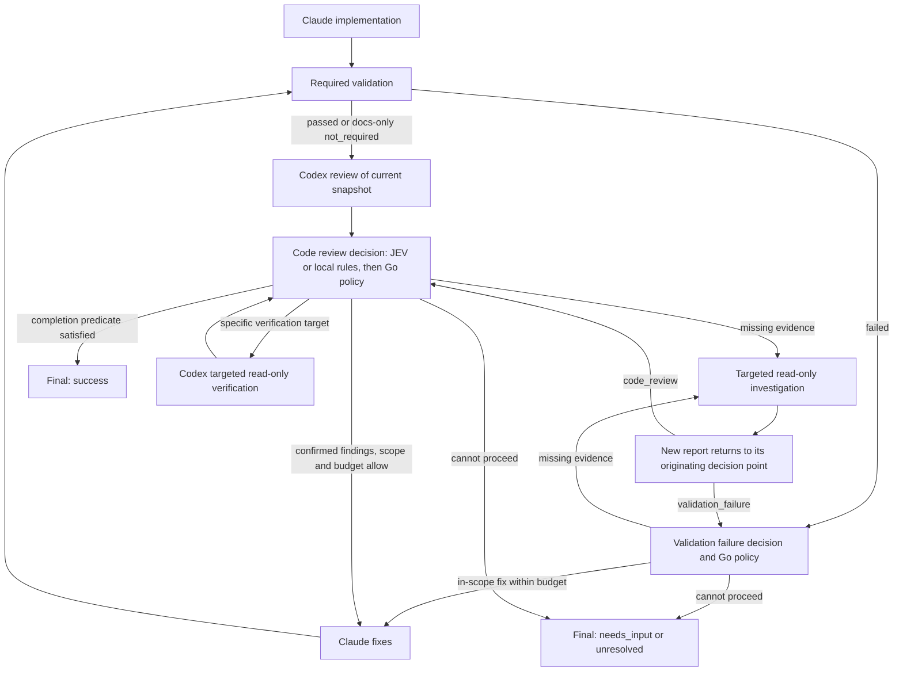

Этот каталог предназначен для разработки глобального CLI-инструмента `dev`.

Сначала проверь фактическое наличие Git repository; не инициализируй его без поручения.

Это должен быть полноценный поддерживаемый Go-проект, который после установки используется из любого другого Git-репозитория командой:

```bash
dev
```

В текущем repository уже могут находиться:

- AGENTS.md;
- инструкции;
- skills для Go;
- project-specific conventions.

Сначала обязательно исследуй текущий repository и прочитай все существующие инструкции и skills.

Используй существующие Go skills при реализации.

Не удаляй и не перезаписывай существующие skills или инструкции без необходимости.

Объём текущей задачи задаёт запрос пользователя. Следующий список относится к полной реализации приложения, а не к каждой правке документации или отдельного модуля.

При поручении полной реализации не останавливайся после planning. Нужно полностью:

1. спроектировать;
2. реализовать;
3. протестировать;
4. создать Taskfile;
5. собрать приложение;
6. установить binary;
7. выполнить smoke tests;
8. оставить Git repository готовым к commit.

---

# 1. Что мы создаём

Приложение называется:

```text
dev
```

Это локальный AI development orchestrator на Go.

Он управляет:

- Claude Code;
- Codex CLI;
- OpenRouter;
- TypeSafe JEV через OpenRouter Decisions API;
- Git;
- Taskfile рабочего проекта;
- SSH для диагностики серверов;
- workflow разработки.

Основные AI-модели уже доступны пользователю через установленные:

```bash
claude
codex
```

Не нужно использовать API Claude/OpenAI вместо существующих CLI.

OpenRouter нужен в первую очередь для JEV.

---

# 2. Основной UX

После установки я должен иметь возможность перейти в любой Git-проект:

```bash
cd ~/projects/backend
```

и выполнить просто:

```bash
dev
```

Программа должна определить текущий Git repository и запустить интерактивный режим прям в этом проекте.

Например:

```text
Project: /home/sergey/projects/backend

What do you want to work on?

> Fix duplicate appointments created during concurrent requests
```
При этом я хочу иметь возмжность прям удобно вставлять в эту строку длинные тексты с длинным ТЗ

После этого:

- если OpenRouter/JEV настроен — JEV автоматически выбирает workflow и затем помогает выбирать следующие шаги в предусмотренных decision points;
- если JEV отсутствует или недоступен — пользователь выбирает workflow вручную.

Также должны работать прямые команды:

```bash
dev feature "Add bulk appointment cancellation"
dev bug "Appointments are duplicated"
dev bug --server production "API periodically returns 502"
dev architecture "Should this module become a Go service?"
dev research "How does authorization work here?"
dev refactor "Move appointment matching into a separate service"
dev tests "Add coverage for cancellation"
dev review
dev incident "CPU usage increased after deployment"
dev investigate "Find why queue latency increased; do not fix yet"
dev plan "Design bulk cancellation without implementing it"
dev implement --plan /path/to/plan.md "Implement the agreed scope"
dev docs "Update the subscription API documentation"
dev chore "Update CI configuration for the current Go version"
dev fix-review --report /path/to/review.md "Fix confirmed findings"
```

Явные workflow-команды обходят начальную классификацию. Решения внутри workflow могут использовать JEV; для полностью локального режима предусмотрен `--no-jev`.

Для длинных задач поддержать многострочный paste и `--task-file <path>`; `--task-file -` читает stdin. Завершение интерактивного ввода должно быть явным и не терять строки при вставке. Task text из файла и positional task взаимоисключающие; сам файл задачи не является разрешением расширять права workflow.

## 2.1. Отображение процесса в терминале

Пользователь должен понимать, что происходит сейчас, кто выполняет работу, какие этапы уже завершены и почему запускается следующий этап. Это обязательный UX для `dev` и явных workflow-команд, включая read-only workflows, manual routing и режим без JEV.

### Начало запуска и маршрут

С момента начала длительной операции показывать её название: определение проекта, preflight, выбор workflow или запрос JEV. Не оставлять пустой терминал до первого ответа агента.

По мере получения данных сформировать компактный блок запуска:

- working project и Git branch;
- наличие исходных staged/unstaged/untracked изменений, без полного diff;
- run ID и выбранный workflow;
- источник routing: явная команда, JEV или ручной выбор; confidence только если она реально получена;
- разрешённый режим: local write, documentation-only, local/remote read-only;
- каталог artifacts.

После выбора workflow показать короткий маршрут с понятными названиями этапов и ответственными агентами. Необязательные fixes, verification и дополнительные investigations обозначить как возможные ветки. Число будущих этапов меняется по решениям engine: не показывать выдуманный процент готовности, гарантированное время завершения или фиксированное «шаг N из M» для динамического workflow.

### Лента этапов и текущая работа

Перед запуском каждого stage немедленно вывести его номер в истории run, понятное название, исполнителя (`Claude`, `Codex`, `task all`, `JEV` или local policy) и режим доступа. После завершения показать status, длительность и короткий проверенный итог, например «план сохранён», «validation passed», «найдены 2 confirmed findings». Process exit code 0 сам по себе не означает успешное завершение stage: итог учитывает проверенный report и engine facts.

Завершённые этапы сохраняются в scrollback. Текущий этап визуально выделяется; ожидающие и условные этапы отличаются от завершённых. Повторные этапы имеют отдельные записи с номером round и соответствующим лимитом, например `review fixes 1/2`, `code review pass 2/3`. Пропущенная проверка имеет status и причину `not_required`, а не отметку о прохождении.

В обычном режиме показывать существенные подтверждённые события, если adapter умеет получать их из установленного CLI: начало tool operation, получение report, сохранение результата, переход к validation/review. Сообщение объясняет действие коротко и не превращает терминал в полный transcript. Не выдумывать активность, рассуждения агента или промежуточные результаты. Если granular events недоступны, достаточно честного «ожидаем ответ Codex» с таймером.

Пока stage работает:

- в TTY показывать spinner или другой ненавязчивый индикатор активности и elapsed time, обновляя таймер примерно раз в секунду без добавления строк на каждый tick;
- при отсутствии новых событий более 30 секунд явно показывать, что операция ещё выполняется и новых сообщений нет; индикатор означает ожидание, а не доказательство полезного прогресса;
- без TTY выводить обычные строки начала/завершения и редкий heartbeat: не оставлять активную операцию без status update дольше 30 секунд;
- при deadline/timeout показывать причину остановки; продолжающий вращаться spinner не заменяет обработку зависшего subprocess.

Исключение для фоновых status updates — явно выбранный `--quiet`. Таймер и heartbeat не выполняют дополнительных запросов к AI/JEV. Их обновление не блокирует runner, cancellation или engine.

### Решения, проверки и ожидание пользователя

Показывать применённый переход и краткую причину из проверенного report и Go policy: например «Code review: 1 confirmed high finding → Claude fixes → task all → Codex re-review». Рекомендация JEV до проверки policy не отображается как уже запущенное действие. При fallback показывать безопасную причину и фактический режим продолжения; отсутствие key — нормальный local/manual режим. Не приписывать JEV текстовое reasoning.

Validation отображается отдельным этапом: команда `task all`, начало, время выполнения, passed/failed/not_required. При failure показать компактный очищенный фрагмент ошибки, путь к сохранённому output и решение о следующем шаге. Не объявлять отдельные tests/linters успешными, если такого факта нет в output. При исправлениях явно показать их причину и оставшийся budget; пользователь должен отличать продолжающийся workflow от завершённого failed run.

При параллельных incident investigations показывать отдельные состояния Claude и Codex с собственными таймерами. Сообщения маркируются agent/stage и выводятся согласованно, без перемешивания строк. Отображение обоих статусов пользователю не передаёт выводы одного агента другому до synthesis.

Когда действительно требуется ответ пользователя, статус становится «Нужен ваш ответ» с конкретным вопросом. Non-interactive run завершается `needs_input` по существующему контракту; UI не создаёт скрытого ожидания ввода. Принятый user update отображается коротким подтверждением и указанием, применяется ли он сейчас или на следующей безопасной границе stage.

### Оформление и потоки вывода

Интерфейс должен быть аккуратным и удобным для быстрого чтения: компактный блок запуска, отступы и разделение этапов, единый набор status markers, сдержанные цвета. Пояснения интерфейса — на русском; commands, agent names, config keys и machine statuses сохраняются на английском. Не использовать большие баннеры, декоративные рамки на весь экран или обязательные emoji.

Status markers имеют текстовые подписи, например `✓ Завершён`, `▶ Выполняется`, `○ Ожидает`, `! Требует внимания`, `✗ Ошибка`. Цвет дополняет подпись, а не заменяет её. Успешно завершённый отдельный stage визуально не означает success всего run.

Обычный вывод остаётся читаемым в терминале шириной 80 колонок и при изменении ширины. Длинные сообщения и paths аккуратно переносятся; важные ошибки и путь к artifacts не теряются. Не использовать обязательный fullscreen UI и не очищать историю терминала; перерисовывать только активную область индикаторов.

Progress, интерактивные вопросы и diagnostics идут в stderr; итоговый пользовательский результат — в stdout. TTY capabilities проверять для фактического output stream, а не только для stdin/stdout. При перенаправленном stdout итог не содержит ANSI sequences; перенаправленный stderr не содержит анимации, возвратов каретки и cursor control. Plain mode сохраняет смысл и порядок событий; при отсутствии поддержки Unicode использовать ASCII markers.

Цвет отключается через `--no-color`, непустой `NO_COLOR`, `TERM=dumb` и автоматически для output stream без TTY. При `TERM=dumb` отключать также cursor control и анимацию. Не требовать настройки shell для читаемого вывода.

`--quiet` скрывает маршрут, обычные события и heartbeat, сохраняя итоговый результат, ошибки и обязательные вопросы. `--verbose` добавляет безопасные подробности stages/decisions, durations, budgets и очищенный доступный output внешних программ. `--quiet` и `--verbose` взаимоисключающие. Ни один режим не раскрывает secrets, private keys или скрытые рассуждения моделей.

Захваченный вывод agents, Task и SSH проходит очистку секретов и недоверенных terminal control sequences до отображения и сохранения. Произвольный escape sequence из subprocess не может очистить экран, изменить заголовок терминала или создать поддельную строку success. UI не ослабляет правила artifacts и provider payload из других разделов ТЗ.

### Завершение

После успеха, findings, unresolved, needs_input, ошибки или отмены завершить активные индикаторы и показать компактный итог: outcome и понятное объяснение, общую длительность, выполненные/незавершённые этапы, validation/review result, оставшиеся blocking findings/criteria и каталог доступных artifacts. Если artifacts создать не удалось, явно указать это. Для read-only workflow вывести содержательный final answer/report, а не только путь к файлу.

При неуспешном исходе указать stage и причину остановки, сохранив сведения о завершённой работе и возможных partial writes. Предложить конкретный следующий шаг, если он известен, без обещания автоматического resume, которого нет в CLI. Исчерпание лимита не получает зелёный success. Outcome совпадает с `run.json` и exit status из раздела 28.

### Пример отображения

Пример экрана во время feature run; маркеры показывают завершённые, активный и ожидающие этапы. Это пример оформления, а не фиксированная последовательность для всех workflows:

```text
dev · feature
Проект:    /home/sergey/projects/backend · main
Git:       исходные изменения — 1 unstaged, 1 untracked
Run:       20260926-101503-abc
Routing:   явная команда · decisions: local
Режим:     local write; planning/review — read-only
Artifacts: ~/.local/state/dev-agent/runs/backend/20260926-101503-abc/

Маршрут: план → review плана → реализация → task all → code review
         При findings: fixes → task all → re-review

✓ 01 Планирование       Claude · read-only     42s
     План сохранён: plan.md
✓ 02 Review плана       Codex · read-only      28s
     Блокирующих замечаний нет; разрешена реализация
▶ 03 Реализация         Claude · local write   1m 12s
     Ожидаем ответ Claude · новых сообщений нет 30s
○    Validation         task all
○    Code review        Codex · read-only

Ctrl+C — отменить запуск
```

Финальный блок после успешного завершения:

```text
✓ success · Задача выполнена · 4m 18s
  Результат: добавлена bulk cancellation; итоговый отчёт ниже
  Validation: task all passed
  Code review: blockers отсутствуют, проверен текущий snapshot
  Artifacts: ~/.local/state/dev-agent/runs/backend/20260926-101503-abc/
```

---

# 3. Технология

Основной язык:

```text
Go
```

Не реализовывай orchestration большим shell script.

Используй Go:

- `context.Context`;
- `os/exec`;
- normal structs/interfaces;
- typed configuration;
- proper error handling;
- subprocess management;
- signal handling;
- tests.

Shell допустим только как запускаемая внешняя команда там, где это действительно требуется.

Не использовать `sh -c` для пользовательского input без крайней необходимости.

---

# 4. Repository самого dev-agent

Это отдельный проект исходников; Git state проверяется по фактическому состоянию каталога.

Организуй его как нормальное Go-приложение.

Ориентировочная структура:

```text
.
├── cmd/
│   └── dev/
│       └── main.go
│
├── internal/
│   ├── agent/
│   │   ├── agent.go
│   │   ├── claude.go
│   │   └── codex.go
│   │
│   ├── router/
│   │   ├── router.go
│   │   ├── manual.go
│   │   └── jev/
│   │       ├── router.go
│   │       ├── client.go
│   │       └── types.go
│   │
│   ├── decision/       # Decision points, JEV adapter и local fallback
│   │
│   ├── workflow/
│   │   ├── workflow.go
│   │   ├── feature.go
│   │   ├── bug.go
│   │   ├── architecture.go
│   │   ├── research.go
│   │   ├── refactor.go
│   │   ├── tests.go
│   │   ├── review.go
│   │   └── incident.go
│   │
│   ├── project/
│   ├── validation/
│   ├── git/
│   ├── runner/
│   ├── artifacts/
│   ├── remote/
│   ├── config/
│   └── ui/
│
├── prompts/
├── Taskfile.yml
├── go.mod
├── go.sum
├── README.md
├── AGENTS.md
└── .gitignore
```

Это ориентир, не жёсткое требование.

Не overengineer.

---

# 5. Taskfile самого dev-agent

Создай `Taskfile.yml`.

Минимум:

```bash
task fmt
task vet
task test
task build
task lint
task all
task install
task clean
task help
```

В task help вывести все доступные команды, а также инструкцию по пользованию скрипта (как запускать dev, какие есть параметры). Инструкция на русском языке.

`task all` — canonical validation самого `dev-agent`.

Он должен выполнять минимум:

```text
format validation
go vet
go test ./...
build
```

Go linter — также использовать его.

Не добавлять тяжёлые dependencies без необходимости.

---

# 6. Установка

Команда:

```bash
task install
```

должна собрать приложение и установить:

```text
~/.local/bin/dev
```

Если каталог отсутствует:

```text
~/.local/bin
```

создай его.

После установки должно работать:

```bash
dev --help
dev doctor
dev
```

Если `~/.local/bin` отсутствует в `$PATH`, не изменяй пользовательские dotfiles молча.

Выведи точную рекомендацию.

---

# 7. Определение рабочего проекта

`dev` запускается внутри стороннего проекта.

Например:

```bash
cd ~/projects/clinic-backend
dev
```

Определи project root через Git.

Эквивалент:

```bash
git rev-parse --show-toplevel
```

Этот repository называется:

```text
working project
```

Repository исходников самого `dev` и working project — разные вещи.

Никогда их не путать.

---

# 8. Контекст working project

Ищи в root:

```text
AGENTS.md
CLAUDE.md
Taskfile.yml
.dev-agent.yaml
```

Если присутствуют другие нативные инструкции Claude/Codex — учитывать их стандартным способом соответствующего CLI.

`AGENTS.md` считать основным project context для обоих агентов.

---

# 9. Validation всех рабочих проектов

Во всех моих проектах уже существует Taskfile и команда:

```bash
task all
```

Это единственный обязательный validation contract.

Оркестратор не должен знать, что конкретно находится внутри:

- PHPUnit;
- PHPStan;
- ESLint;
- TypeScript;
- Vitest;
- Go tests;
- linters;
- etc.

После изменения source code запускать:

```bash
task all
```

Если validation падает:

- сохранить output;
- определить, связано ли падение с текущими изменениями;
- передать relevant output агенту, который выполнял реализацию;
- попытаться исправить;
- повторить `task all`.

Не исправлять unrelated pre-existing failures без необходимости.

---

# 10. Claude Code и Codex CLI

Перед реализацией integration обязательно исследуй реальные установленные версии:

```bash
claude --version
claude --help

codex --version
codex --help
```

Не полагайся на память о CLI flags.

Определи реальные способы:

- non-interactive invocation;
- read-only / planning invocation;
- workspace write access;
- working directory;
- prompt input;
- stdin;
- timeout;
- cancellation;
- exit code.

Создай общий интерфейс приблизительно:

```go
type Agent interface {
    Run(ctx context.Context, req Request) (Result, error)
}
```

Например:

```go
type Request struct {
    ProjectDir string
    Prompt     string
    Mode       Mode
    Timeout    time.Duration
}
```

Реализации:

```text
ClaudeAgent
CodexAgent
```

Workflow engine не должен зависеть от конкретных CLI flags.

---

# 11. OpenRouter

OpenRouter является частью приложения.

Использовать environment variable:

```bash
OPENROUTER_API_KEY
```

как основной способ передачи ключа.

Также разрешить настройку через global config.

Например:

```text
~/.config/dev-agent/config.yaml
```

Секрет никогда:

- не логировать;
- не писать в artifacts;
- не передавать Claude/Codex;
- не коммитить;
- не показывать в `dev doctor`.

Если API key хранится в config file, убедиться, что файл имеет безопасные permissions, желательно `0600`.

Environment variable имеет приоритет над config.

---

# 12. OpenRouter JEV

Начальная классификация и решения внутри workflow должны использовать JEV через OpenRouter, если он настроен. Это две разные обязанности: Router выбирает workflow, DecisionService рекомендует переход в уже выбранном workflow.

Endpoint:

```text
POST https://openrouter.ai/api/alpha/decisions
```

Authorization:

```text
Authorization: Bearer $OPENROUTER_API_KEY
```

Default model:

```text
~typesafe/jev-latest
```

Но model должен настраиваться.

Например пользователь может закрепить:

```text
typesafe/jev-1.13
```

Конфиг:

```yaml
router:
  type: jev

openrouter:
  api_key: ""
  base_url: "https://openrouter.ai"
  jev_model: "~typesafe/jev-latest"
  timeout: 10s
```

Не hardcode конкретную версию JEV в workflow engine.

---

# 13. Router abstraction

Создай интерфейс:

```go
type Router interface {
    Route(
        ctx context.Context,
        input RouteInput,
    ) (RouteDecision, error)
}
```

Минимум две реализации:

```text
JevRouter
ManualRouter
```

В будущем должно быть легко добавить другие routers.

Для решений после этапов добавь отдельный контракт, сохранив `Router.Route` и `Agent.Run`:

```go
type DecisionService interface {
    Decide(ctx context.Context, input DecisionInput) (StepDecision, error)
}
```

`DecisionInput` содержит decision point, безопасный итог этапа, разрешённые действия и оставшиеся лимиты. `StepDecision` содержит typed action, confidence/probabilities и источник решения. Engine определяет разрешённые действия до вызова сервиса и повторно проверяет ответ перед переходом.

Реализации: `JevDecisionService` и `LocalDecisionService`. Router и DecisionService могут использовать общий HTTP client, но engine не знает JSON shape OpenRouter. LocalDecisionService реализует явные правила fallback из раздела 27, а не вызывает Claude/Codex для замены классификатора.

---

# 14. Что отправлять в JEV

Не отправлять repository целиком.

Не отправлять:

- source code;
- git diff;
- credentials;
- production logs;
- customer data;
- database content.

Для routing обычно достаточно:

```json
{
  "task": "...",
  "project": {
    "languages": ["PHP", "TypeScript"],
    "has_taskfile": true
  }
}
```

Metadata можно получать локально.

Передавать только минимум, необходимый для принятия решения.

После ответов Claude/Codex отправлять в JEV нормализованный итог этапа, а не полный transcript, Markdown review или содержимое artifacts. Полный report с repository evidence остаётся локально и передаётся следующему агенту в рамках workflow.

Engine строит отдельный payload по allowlist: workflow/stage, результат этапа, coverage требований, число findings по severity/status, наличие разногласий и недостающих evidence, состояние validation, прогресс и оставшиеся лимиты. Категории проблем задаются enum, например `security`, `correctness`, `compatibility`, `missing_tests`, `requirements_gap`. Произвольные тексты findings, paths, snippets, logs, stdout/stderr и команды из ответа агента в этот payload не попадают.

Task text тоже проверять: введённые пользователем logs, credentials, customer data или code blocks не становятся безопасными только потому, что это поле `task`. Если безопасный минимальный контекст нельзя выделить без потери смысла, использовать local/manual fallback и сохранить причину без запрещённых данных.

Нормализованный report — утверждение агента, а не доказательство. JEV выбирает полезный следующий шаг по этим данным; correctness устанавливается локальными evidence, validation и review. Недостаток контекста не компенсируется отправкой source code в OpenRouter.

---

# 15. Решение JEV

Одним request по возможности определить:

```text
workflow
complexity
risk
plan_review_required
code_review_required
parallel_investigation_required
```

Workflow choices:

```text
feature
bug
server_bug
architecture
research
refactor
tests
review
incident
investigate
plan
implement
docs
chore
fix_review
```

Complexity:

```text
trivial
low
medium
high
```

Risk:

```text
low
medium
high
critical
```

Использовать native JEV decision types:

```text
choice
score
noul
```

Не просить JEV генерировать prose.

`plan_review_required`, `code_review_required` и `parallel_investigation_required` относятся к предусмотренным optional branches. Отрицательный ответ не отменяет обязательный этап выбранного workflow. Например feature всегда проходит plan review и code review; incident всегда начинает с двух независимых investigations. Низкая оценка risk не снижает permissions и не разрешает remote writes.

Если task требует нескольких разных результатов, выбрать основной workflow и сохранить остальные как отдельные follow-up tasks. Research/review/incident не превращаются автоматически в implementation. Для выбора `implement` или `fix_review` нужен явно переданный план/report и разрешённый пользователем writing scope; одного ответа Router недостаточно.

---

# 16. Confidence и проверка typed decisions

Использовать native `questions`/`state` и `answers` из [официального Decisions API](https://openrouter.ai/docs/api/api-reference/alphadecisions/submit-a-decisions-request). Семантика primitives описана в [JEV documentation](https://openrouter.ai/docs/guides/community/jev):

- `choice` возвращает выбранный вариант, confidence и probabilities;
- `score` возвращает позицию на заданной шкале, confidence и probabilities; это не обязательно целое число;
- `noul` возвращает вероятность «да» в поле `noul`; отдельное поле confidence для него не предполагать.

Проверять обязательные questions, type, допустимые choices, диапазоны и конечность чисел, probabilities и их согласованность по официальному контракту. Не трактовать missing/unknown value как `false` или успешный результат. У выбранного action должны быть пройдены все применимые thresholds, включая согласованность дополнительных questions.

Не использовать один magic threshold. Начальный выбор использует `router.confidence` отдельно для workflow/complexity/risk; переходы — `decisions.confidence` по decision point. Для boolean questions использовать `router.noul_yes`/`router.noul_no` при routing и соответствующие `decisions` thresholds внутри workflow: значение между yes/no считается неопределённым. Порог probability и confidence — разные проверки. Defaults в разделе 33 являются стартовой политикой приложения, а не гарантией качества модели; предусмотреть настройку по сохранённым decisions и тестовым примерам.

Нет key, низкая confidence/неопределённый noul, timeout, network error, 4xx/5xx, invalid response, недоступный JEV/model или исчерпанный бюджет запросов:

- для начального routing — `ManualRouter`; без interactive input и явно выбранного workflow завершиться с `needs_input`, а не ждать stdin бесконечно;
- внутри workflow — `LocalDecisionService`; если безопасный переход неоднозначен, запросить уточнение в interactive режиме либо завершиться с `needs_input`.

Failure JEV не обнуляет уже выполненные этапы и не перезапускает workflow. Cancellation пользователя имеет приоритет над fallback. JEV никогда не должен быть single point of failure.

---

# 17. Режим без OpenRouter

Если:

```text
OPENROUTER_API_KEY
```

не определён и ключ отсутствует в config — это нормальное состояние.

При запуске:

```bash
dev
```

после ввода задачи показать:

```text
Select workflow:

1. Feature
2. Bug
3. Production/server bug
4. Architecture / design
5. Research / question
6. Refactor
7. Tests
8. Code review
9. Incident investigation
10. Investigation without fixes
11. Plan without implementation
12. Implement an existing plan
13. Documentation
14. Maintenance / chore
15. Fix an existing review
```

После выбора выполняется тот же Workflow Engine.

Все workflows и обязательные проверки доступны без JEV. Внутренние решения выполняет LocalDecisionService; пользователь выбирает только действительно неоднозначный scope или требования. Для `implement` и `fix_review` дополнительно получить путь к plan/report. В non-interactive режиме недостающие входные данные дают `needs_input` без запуска writer.

---

# 18. FEATURE workflow

Feature workflow должен быть:

```text
Claude
  ↓
plan

Codex
  ↓
plan review

plan_review decision → при необходимости Claude revises plan → Codex re-review

Claude
  ↓
implementation

task all
  ↓

Codex
  ↓
code review

code_review decision
  ├─ complete
  ├─ verify → Codex targeted verification → decision
  └─ fix → Claude fixes → task all → Codex re-review → decision
```

## Stage 1 — Claude planning

Claude:

- исследует repository;
- понимает существующую архитектуру;
- не изменяет source code;
- составляет implementation plan;
- определяет затронутые модули;
- определяет edge cases;
- определяет tests;
- анализирует security;
- анализирует concurrency/transactions при необходимости;
- избегает unnecessary refactoring.

Artifact:

```text
plan.md
```

## Stage 2 — Codex plan review

Codex получает:

- task;
- plan;
- repository.

Проводит независимый review.

Проверяет:

- неверные assumptions;
- пропущенные code paths;
- архитектурные проблемы;
- overengineering;
- security;
- concurrency;
- backwards compatibility;
- missing tests;
- migration/data issues.

Не изменяет код.

Artifact:

```text
plan-review.md
```

## Stage 3 — Claude implementation

Claude получает:

- original task;
- plan;
- Codex plan review.

Он должен сначала оценить замечания Codex.

Не выполнять замечания слепо.

Блокирующие проблемы плана разрешаются в read-only revision/re-review до запуска implementation. Disputed finding требует evidence и проверки reviewer; его нельзя молча отбросить при переходе к записи. Plan gate и лимиты описаны в разделах 27 и 40.

После этого:

- скорректировать подход;
- реализовать feature;
- сделать minimal focused changes;
- добавить tests.

## Stage 4 — validation

```bash
task all
```

Если появились failures, вызванные изменениями Claude:

Claude исправляет их.

После этого снова:

```bash
task all
```

## Stage 5 — Codex code review

Codex проверяет текущий diff.

Проверять:

- correctness;
- regressions;
- security;
- concurrency;
- transactions;
- error handling;
- architecture;
- backwards compatibility;
- API compatibility;
- missing tests;
- unnecessary complexity.

Не писать stylistic nitpicks.

Artifact:

```text
review.md
```

## Stage 6 — Claude fixes

Claude получает review.

Он обязан проверить каждое замечание.

Исправлять только валидные findings.

## Stage 7

```bash
task all
```

После любых fixes обязательно Codex re-review обновлённого состояния и повторный decision point. Успешный `task all` сам по себе не закрывает review findings. Если fixes не требуются и completion predicate выполнен, writer не запускается.

---

# 19. BUG workflow

Flow:

```text
Codex
  ↓
investigation + plan

Claude
  ↓
fix

task all

Codex
  ↓
review

Claude
  ↓
fix confirmed findings, if required

task all → Codex re-review → code_review decision
```

## Codex investigation

Codex:

- исследует repository;
- пытается безопасно воспроизвести проблему;
- определяет root cause;
- приводит repository evidence;
- анализирует related code paths;
- составляет минимальный fix plan;
- не изменяет код.

Artifacts:

```text
investigation.md
plan.md
```

## Claude fix

Claude:

- независимо проверяет diagnosis;
- если hypothesis неверна — возвращает read-only report в diagnosis decision point; дополнительное investigation выполняет Codex до writing stage;
- реализует минимальный fix;
- добавляет regression test, если разумно;
- избегает unrelated refactoring.

После этого:

```bash
task all
```

Diagnosis должен иметь evidence; неподтверждённая hypothesis не является достаточным основанием для fix. Если безопасно воспроизвести проблему невозможно, зафиксировать ограничения и выбрать targeted investigation или `needs_input`. Review/fix/validation/re-review используют общий цикл из раздела 40.

Codex делает review.

Claude исправляет подтверждённые findings.

Финально:

```bash
task all
```

---

# 20. BUG НА СЕРВЕРЕ

Поддержать:

```bash
dev bug --server production "API periodically returns 502"
```

Server profiles:

```text
~/.config/dev-agent/config.yaml
```

Если в проекте доступен скилл server-debug, использовать его.

Например:

```yaml
servers:
  production:
    host: app.example.com
    user: deploy
    port: 22
    project_path: /srv/application
```

Использовать стандартные:

```text
~/.ssh/config
ssh-agent
SSH keys
```

Не хранить SSH private keys/passwords в config.

## Remote investigation

Default:

```text
READ ONLY
```

Codex является главным investigator.

Можно читать environment variable names, но не secret values.

Artifacts:

```text
remote-investigation.md
investigation.md
plan.md
```

Если проблема находится в source code:

Claude исправляет LOCAL working project.

После этого:

```bash
task all
```

Codex делает review.

Не деплоить автоматически.

Remote writes должны быть отдельным явно разрешённым режимом.

При изменениях действует общий цикл validation/re-review. Если причина операционная, а не в local source code, завершить diagnosis и recommendations без запуска Claude writer. Несоответствие remote revision и local checkout явно учитывать в плане.

---

# 21. ARCHITECTURE workflow

Команда:

```bash
dev architecture "Should we split telephony routing into a Go service?"
```

Workflow:

```text
Codex
  ↓
research + draft

Claude
  ↓
critical review

Codex
  ↓
final answer
```

## Codex draft

Codex:

- исследует repository;
- собирает repository evidence;
- описывает текущую архитектуру;
- рассматривает варианты;
- определяет trade-offs;
- пишет draft.

Разделяет:

```text
Facts
Assumptions
Options
Trade-offs
Recommendation
```

Artifact:

```text
draft.md
```

## Claude review

Claude критически проверяет:

- assumptions;
- альтернативы;
- architecture risks;
- scalability;
- operational complexity;
- migration costs;
- testing;
- deployment;
- maintainability;
- overengineering.

Artifact:

```text
review.md
```

## Codex final

Codex получает review Claude.

Проверяет замечания.

Корректирует первоначальный ответ.

Artifact:

```text
final.md
```

Final answer выводится в terminal.

Source code не изменять.

После critical review выполняется `answer_review` decision: Codex либо дорабатывает draft, либо собирает недостающие evidence, либо готовит final. Существенные нерешённые противоречия не скрывать финальным переписыванием текста. Повторный review нужен после существенного изменения выводов; количество rounds ограничено разделом 40.

---

# 22. RESEARCH workflow

Команда:

```bash
dev research "How does authorization work in this project?"
```

Flow:

```text
Codex
  ↓
investigation + draft

Claude
  ↓
review

Codex
  ↓
final answer
```

Главное:

```text
repository evidence > assumptions
```

Не изменять код.

Использовать тот же `answer_review` gate. Final отвечает на исходный вопрос, ссылается на evidence и явно обозначает оставшиеся неизвестные. Допустимый результат исследования — обоснованная невозможность подтвердить hypothesis; выдуманный однозначный ответ не является completion.

---

# 23. REFACTOR workflow

Flow:

```text
Codex
  ↓
scope investigation + plan

Claude
  ↓
implementation

task all

Codex
  ↓
review

Claude
  ↓
fixes

task all → Codex re-review → code_review decision
```

Главное требование:

```text
observable behaviour must remain unchanged
```

План содержит проверяемые invariants поведения и compatibility; при high-risk изменениях проходит Codex self-check и Claude critical review read-only до implementation. При обнаружении необходимости менять поведение не маскировать feature под refactor: запросить scope clarification. После реализации использовать общий цикл review/fix.

---

# 24. TESTS workflow

Flow:

```text
Codex
  ↓
test coverage analysis + plan

Claude
  ↓
test implementation

task all

Codex
  ↓
review
```

Production code менять только если без этого невозможно корректно протестировать поведение и изменение оправдано.

Обоснование изменения production code должно быть частью плана до writing stage. Если оно выходит за порученный scope, остановиться для уточнения. Failed validation и findings не завершают workflow: Claude исправляет, затем `task all` и Codex re-review по общему циклу.

---

# 25. REVIEW workflow

Поддержать:

```bash
dev review
dev review --base main
```

Codex:

- основной reviewer;
- анализирует diff;
- формирует findings.

Claude:

- независимо проверяет серьёзные findings;
- ищет пропущенные critical/high issues;
- удаляет false positives.

Финальный output:

- severity;
- file;
- line/range;
- problem;
- impact;
- suggested direction.

Не изменять код.

Не писать useless style comments.

`review_verification` decision выбирает между final report и дополнительной целевой read-only проверкой спорных/недостаточно доказанных findings. JEV не удаляет finding и не подтверждает его валидность по счётчику severity. Codex формирует единый final с verdict `pass`, `findings` или `inconclusive`; они соответствуют run outcomes `success`, `findings`, `unresolved`. Каждый disputed finding сохраняет аргументы обеих сторон и missing evidence.

Даже при confirmed findings этот workflow остаётся read-only. Исправление — отдельный `fix-review`, выбранный пользователем. Для review зафиксировать base/head/merge-base либо snapshot текущего staged/unstaged/untracked состояния; drift во время review требует новой привязки evidence, а не публикации устаревшего pass.

---

# 26. INCIDENT workflow

Команда:

```bash
dev incident "Workers started consuming 100% CPU after deployment"
```

Claude и Codex должны провести независимые investigations.

Они не должны видеть выводы друг друга до завершения initial investigation.

Если в проекте доступен скилл server-debug, использовать его.

Если investigation read-only, разрешить параллельное выполнение.

После этого Codex получает оба reports и делает synthesis:

```text
Confirmed facts
Hypotheses
Disagreements
Likely root cause
Missing evidence
Next diagnostic steps
Recommended remediation
```

Не применять изменения автоматически только на основании hypothesis.

После synthesis `diagnosis` decision может назначить bounded targeted diagnostics при missing evidence. Новые investigations остаются read-only; независимость initial reports сохраняется в artifacts. Для remote incident поддержать `--server <profile>` с теми же ограничениями, что у server bug. Рекомендация remediation не запускает bug/fix/deploy workflow без отдельного writing scope пользователя.

## 26.1. Дополнительные workflows

Следующие сценарии входят в первую реализацию, поскольку у них разные входы, права и условия завершения. Общие этапы использовать повторно, без копирования engine для каждого имени.

| Workflow / CLI | Вход и роли | Результат и права |
| --- | --- | --- |
| `investigate` / `dev investigate "..."` | Codex diagnosis → Claude проверка evidence → Codex final; `diagnosis` gate может запросить дополнительную проверку | Root cause либо список hypotheses/missing evidence и следующий диагностический шаг. Working project read-only; `--server` добавляет remote read-only |
| `plan` / `dev plan "..."` | Claude plan → Codex plan review → bounded Claude revisions и Codex re-review | `plan.md` с scope, acceptance criteria, шагами, risks и validation strategy. Implementation не запускается |
| `implement` / `dev implement --plan <path> "..."` | Codex проверяет plan относительно текущего проекта → при необходимости Claude revises/Codex re-review → Claude implementation → общий цикл validation/review | Изменения только по явно порученному scope; imported plan не заменяет проверку применимости |
| `docs` / `dev docs "..."` | Claude проверяет факты и готовит plan → Claude редактирует documentation → Codex проверяет точность, примеры и полноту → Claude fixes/re-review при необходимости | Запись только в согласованные docs paths. Source/config не меняются для подгонки под текст |
| `chore` / `dev chore "..."` | Codex анализирует compatibility/impact и составляет plan → Claude меняет tooling/config/dependencies → validation → Codex review → общий цикл fixes | Focused maintenance change с проверкой совместимости; не включает deploy, publication и применение migrations к remote DB |
| `fix_review` / `dev fix-review --report <path> "..."` | Codex сверяет findings с текущим состоянием → Claude проверяет и исправляет confirmed findings → validation → Codex re-review | Закрытые findings с evidence или явный unresolved report. Отчёт со старым path/line не применяется слепо |

`--plan`/`--report` принимают локальный файл; ссылка на прежний artifact разрешается пользователем через `dev show`. Engine сохраняет snapshot входа в новом run. Документ считается данными: встроенные инструкции не могут расширить permissions, заменить пользовательскую задачу или отменить validation. Для импортированного Markdown первый read-only этап создаёт текущий structured report.

Plan artifact содержит project identity, inspected revision/snapshot, assumptions, acceptance criteria и review outcome. Если plan устарел, пересмотреть затронутые assumptions. Утверждение «approved» внутри документа не считается разрешением на запись; writing scope задаётся командой и текстом задачи.

Docs-only изменение не требует запуска `task all`, если в проектных инструкциях нет такого требования. Изменение executable examples, generated files, source, tests, dependencies, CI или runtime config требует validation через `task all`. `chore` не является облегчённым путём обхода code review.

Performance, security, dependencies, migrations, CI и UI не требуют отдельных почти одинаковых engines: это специализация task/plan/review criteria. Например performance issue → investigate/bug/refactor с измерениями до/после; security audit → review/research; upgrade → chore; новая migration → feature/chore с отдельным разрешением на реальное применение. Если benchmark или diagnostic изменяет данные, read-only workflow не может выполнить его без разрешённого режима.

---

# 27. JEV в decision points после ответов агентов

В первой реализации JEV используется при начальном routing и в следующих точках выбора. Не требуется network call после каждого stdout event или детерминированного шага.

| Decision point | Данные для решения | Варианты перехода |
| --- | --- | --- |
| `task_readiness` | Ясность scope/acceptance criteria, недостающие входы, conflicting requirements | `proceed`, `clarify` |
| `diagnosis` | Diagnosis verification, evidence completeness, hypotheses/disagreements, scope локального fix | `proceed`, `investigate`, `finalize`, `clarify` |
| `plan_review` | Coverage требований, blockers, disputed assumptions, applicability текущему проекту | `proceed`, `revise_plan`, `verify`, `clarify` |
| `implementation_result` | Объявленный результат writer, фактические изменения, coverage, blockers | `validate`, `continue_implementation`, `investigate`, `clarify` |
| `validation_failure` | Exit status и локальная классификация failure: current change / pre-existing / infrastructure / unknown | `fix`, `investigate`, `clarify`, `stop` |
| `code_review` | Findings/status/severity, coverage, validation, verification текущей revision, прогресс | `complete`, `fix`, `verify`, `investigate`, `clarify`, `stop` |
| `answer_review` | Проверка draft, gaps, разногласия, существенное изменение выводов | `finalize`, `revise_answer`, `investigate`, `clarify` |
| `review_verification` | Независимая проверка findings и оставшиеся disputed/unsupported выводы | `finalize`, `verify`, `clarify` |

Это общий словарь, а не список действий, доступных в любом состоянии. Engine передаёт только разрешённое подмножество. `proceed` означает следующий предусмотренный шаг, `fix` — локальный writer только в writing workflow, `verify`/`investigate` — read-only, `finalize` — подготовку final report, `stop` — завершение без успеха. JEV не выбирает executable, command, path, provider role или permissions.

Внутренние writing stages (`continue_implementation`, validation repairs и review fixes) выполняет Claude; план feature/plan пересматривает Claude, draft architecture/research — Codex. Targeted code/plan verification выполняет Codex; diagnosis evidence собирает Codex и проверяет Claude. В read-only review Codex и Claude проверяют спорную evidence, final собирает Codex. После revision повторный reviewer сохраняет исходную роль. Разрешённые переходы задаются парой workflow/state: например `diagnosis.proceed` ведёт к writer в bug с подтверждённым local defect, а в investigate допускается только дальнейшая read-only проверка/final. Повторные этапы возвращают новый report в соответствующий gate, не запускают весь workflow заново.

Данные для нового gate собираются локально. `task_readiness` вызывается при недостаточно ясном ответе planning/investigation; при очевидных обязательных входах preflight решает без JEV. После validation success очередной обязательный шаг code review выполняется без decision call. Первое routing request объединяет совместимые questions; каждая новая точка использует один request с `next_action` (`choice`) и необходимыми дополнительными questions, например `evidence_sufficient` (`noul`). Противоречащие друг другу ответы отклоняются.

## 27.1. Отчёт агента и безопасное представление для JEV

Каждый этап выдаёт human-readable artifact и versioned structured `StepReport`. Не определять pass/fail по поиску слов «LGTM», «done» или «ошибок нет». Adapter использует поддерживаемый CLI structured output, а при его отсутствии — явно заданный JSON report contract с локальной проверкой schema.

Минимальные поля локального report:

- `schema_version`, `step_id`, `stage`, `outcome` (`completed`, `incomplete`, `needs_input`);
- `requirements`: ID критериев и `satisfied`, `unsatisfied`, `unknown`, с evidence references;
- `findings`: стабильный ID, severity (`critical`, `high`, `medium`, `low`), category, problem, impact, suggested direction, file/line при применимости и evidence;
- finding status: `proposed`, `confirmed`, `disputed`, `fixed`, `dismissed`; каждое изменение status имеет локальное обоснование;
- missing evidence, disagreements, unresolved questions, scope changes и result artifact references.

Engine добавляет process exit status, реальный validation result, snapshot/revision report, фактический diff и счётчики. Агент не может своим report перезаписать эти факты. Reviewer может выдать `confirmed`, если finding подкреплён проверяемой локальной evidence; неподтверждённая hypothesis имеет `proposed`. `fixed` от writer требует verification reviewer; `dismissed` требует evidence и согласованного reviewer outcome. До этого finding остаётся открытым. Для простых stages неприменимые поля явно пустые, а не неявное успешное значение.

Отказ fixer от замечания превращает его в `disputed` с обоснованием и ведёт к read-only verification. JEV не определяет, кто прав; следующий agent проверяет evidence. Недостаточно подтверждённое замечание не запускает speculative fix, а конфликт о blocking finding не разрешает complete.

Missing/invalid report или противоречие с exit status даёт `incomplete`. Допускается один bounded read-only запрос тому же агенту на исправление формата, без повторного выполнения implementation. Если report по-прежнему невалиден, сохранить ошибку и завершить `failed`; JEV не угадывает результат по transcript.

Пример безопасного `state` для JEV после code review; значения получены из проверенного report и engine facts:

```json
{
  "workflow": "feature",
  "decision_point": "code_review",
  "scope": "local_write",
  "validation": "passed",
  "review_matches_current_snapshot": true,
  "requirements": {"satisfied": 5, "unsatisfied": 0, "unknown": 1},
  "findings": {"confirmed": 0, "disputed": 1, "unverified_fixes": 0},
  "issue_categories": ["missing_tests"],
  "missing_evidence": true,
  "progress": "new_evidence",
  "remaining": {"fix_iterations": 2, "review_passes": 1},
  "allowed_actions": ["verify", "clarify", "stop"]
}
```

В этом примере `complete` исключён engine, хотя reviewer мог написать «pass»: одно требование неизвестно, есть disputed finding. При полном покрытии и отсутствии blockers варианты могут быть `complete` и `verify`. У `verify` должна быть конкретная локальная цель: проверить gap, disputed evidence или обозначенный risk; повторить тот же полный review без причины не считается полезным шагом.

## 27.2. Поведение без JEV и при его ошибке

LocalDecisionService использует следующие defaults. Они же действуют после rejected/low-confidence JEV response и при исчерпании сетевого бюджета.

| Состояние | Локальное решение |
| --- | --- |
| Ясный вход, достаточные evidence, обязательные prerequisites выполнены | Следующий обязательный этап |
| Plan содержит confirmed blocker | `revise_plan` и повторный plan review в пределах лимита |
| Diagnosis неизвестен или reviewer оспаривает evidence | Targeted read-only investigation/verification в пределах лимита; затем `needs_input`/`unresolved`, если данных всё ещё нет |
| Implementation incomplete, но оставшиеся критерии ясны и в scope | Продолжить Claude implementation в пределах общего step budget; затем validation |
| Validation failure доказанно вызван текущим изменением | Claude fix → `task all` в пределах validation repair budget |
| Failure pre-existing/infrastructure/unknown | Без unrelated fixes; read-only investigation по необходимости, затем `unresolved`/`needs_input` с причиной |
| Есть confirmed findings, подлежащие исправлению | Claude fix → validation → Codex re-review, если scope и бюджеты разрешают |
| Finding disputed или fix ещё не verified | Targeted reviewer verification; writer не считается арбитром собственного исправления |
| Completion predicate выполнен, нет мотивированной дополнительной проверки | `complete` или `finalize` по типу workflow |
| Существенный gap в draft | Доработать ответ либо получить missing evidence в пределах лимита |
| Scope конфликтует с запросом, нужны credentials/права или исчерпан обязательный бюджет | `needs_input` либо `unresolved`; не повышать права автоматически |

В interactive режиме уточнять только то, что влияет на требования, scope или разрешение. Повторное разрешение на уже порученные local fixes не запрашивать. Non-interactive run никогда не ждёт ответа пользователя: сохраняет вопрос и завершает `needs_input` с ненулевым exit code.

## 27.3. Условия завершения и пример цикла

Для writing workflow `complete` разрешён только когда acceptance criteria выполнены, обязательные этапы завершены, требуемая validation passed и review относится к текущему snapshot. Если validation не требуется по docs-only policy, engine явно фиксирует `not_required` с причиной. Нет открытых blockers, disputed blocking findings или непроверенных fixes. По умолчанию confirmed `critical`, `high`, `medium` блокируют completion; `low` может остаться как явно указанная рекомендация. `critical`/`high` нельзя сделать неблокирующими конфигурацией или ответом JEV. При необходимости project policy усиливает требования.

Для read-only workflow completion означает выполнение исследовательского/review контракта и честный final report. Review может успешно выполниться как процесс и обнаружить defects: run outcome `findings` отличает этот результат от `success`. Research/investigate могут завершиться ответом с обозначенными unknowns, если задача была исследовать, а не доказать конкретную root cause. Если неизвестное мешает требуемому результату, outcome — `unresolved`/`needs_input`.

Пример: Codex завершил review feature и вернул один confirmed high finding. Engine запрещает `complete`; JEV выбирает `fix` либо сначала целевую `verify`, если есть противоречащие evidence. Claude исправляет finding, `task all` проходит, Codex проверяет исправление и текущий diff. В новом `code_review` gate JEV может выбрать `complete`, если критерии выполнены, или целевую дополнительную `verify`, если остался документированный risk. Каждое решение применяется только после проверки Go policy и оставшихся лимитов.

`pass` без blockers и gaps обычно завершает workflow. Сам факт наличия JEV не требует ещё одного цикла. Ответ `stop` и исчерпание лимита не превращают незавершённую работу в success.

---

# 28. Workflow definitions остаются детерминированными

Важно:

JEV принимает решения о выборе workflow и optional branches.

Но сам workflow контролируется Go-кодом.

Не отдавай JEV управление приложением напрямую.

Правильная модель:

```text
User task
    ↓
JEV
    ↓
RouteDecision + user scope
    ↓
Go Workflow Engine
    ↓
Claude / Codex → StepReport + engine facts
    ↓
DecisionService (JEV или local rules)
    ↓
StepDecision → Go policy / budgets / permissions → разрешённый следующий шаг
```

А не:

```text
JEV самостоятельно решает и выполняет произвольные actions
```

Каждый workflow — конечный набор typed states и переходов с prerequisites и completion predicate. Применение decision — отдельная проверяемая функция; неизвестное action, запрещённая ветка, stale report или превышение бюджета не запускают subprocess. Если разрешён ровно один следующий шаг, сетевой decision request не нужен.

Preflight фиксирует задачу, working project, Git snapshot (staged/unstaged/untracked), разрешённый scope, критерии результата и наличие обязательных tools. Отсутствие `task all` для code-changing workflow обнаруживается до writer. Существующие failures не ослабляют required validation; optional baseline запускается только при обоснованной необходимости, а не для каждого read-only run.

Новая user correction во время run дополняет исходную задачу. Применять её в ближайшей безопасной границе stage, сохранить выполненную работу и пометить затронутые plan/review/validation результаты устаревшими. Если CLI умеет native steering, использовать только проверенный механизм; иначе передать update в следующий stage. Side question не отменяет workflow; cancel и явная замена задачи обрабатываются отдельно. Restriction/cancel немедленно останавливает затронутый running subprocess, если продолжение нарушит новые права. Расширение writing/remote scope требует явного поручения, а не JevDecision.

Терминальные outcomes: `success`, `findings`, `unresolved`, `needs_input`, `failed`, `cancelled`; `running` — промежуточное состояние. Exit code 0 — только `success`, 1 — `findings`/`unresolved`/`failed`, 2 — invalid input/`needs_input`, 130 — Ctrl+C, 143 — SIGTERM. Причины и незавершённые критерии сохраняются в `run.json` и показываются в final. Пустой ответ агента с exit code 0 не считается success.

---

# 29. Artifacts

Runtime artifacts НЕ писать в working project.

Использовать:

```text
~/.local/state/dev-agent/runs/
```

Например:

```text
~/.local/state/dev-agent/runs/clinic-backend/20260926-101503-abc/
```

В зависимости от workflow сохранять:

```text
task.md
route.json
investigation.md
remote-investigation.md
plan.md
plan-review.md
draft.md
implementation.md
diff.patch
review.md
validation.log
final.md
run.json
steps/<step-id>/report.json
steps/<step-id>/output.md
decisions/<decision-id>.json
```

`run.json` содержит:

```text
run_id
project
workflow
router
routing confidence
started_at
finished_at
agents
steps
step durations
exit codes
review iterations
validation result
outcome / termination reason
accepted criteria / unresolved requirements
effective scope / user updates
input and reviewed snapshot references
decision IDs / sources / fallback reasons
remaining and consumed budgets
```

Никаких secrets.

Каждый повторный stage/decision имеет отдельный ID и artifact; предыдущие reports не перезаписывать. Корневые `plan.md`, `review.md`, `validation.log` могут быть итоговым представлением с references на историю steps. Это позволяет восстановить, что проверялось до fixes, почему выбран новый цикл и какой snapshot прошёл final review.

В decision artifact хранить decision point, безопасный input из allowlist, requested/returned model, raw typed answer, probabilities, thresholds, allowed actions, recommended action и applied action, источник (`jev`, `local`, `user`, `policy`), причину rejection/fallback и duration/usage при наличии. Raw HTTP errors предварительно очищать; prompts/полные agent reports в этот artifact не копировать.

---

# 30. Git safety

До начала работы:

- определить branch;
- сохранить initial git status;
- определить existing dirty files.

Рабочий repository может быть dirty.

Нельзя терять пользовательские изменения.

Никогда автоматически:

```bash
git reset --hard
git clean -fd
git restore .
git checkout .
git rebase
git commit
git push
```

Не делать commit автоматически.

Не делать push автоматически.

При формировании review необходимо по возможности отделять изменения текущего run от существовавших ранее.

---

# 31. Parallel agents

Claude и Codex можно запускать параллельно только если оба работают READ ONLY.

Например incident investigations.

Никогда не запускать два writing agents одновременно над одним working tree.

---

# 32. Prompts

Prompts должны храниться отдельно от workflow implementation.

Например:

```text
prompts/
├── feature-claude-plan.md
├── feature-codex-plan-review.md
├── feature-claude-implement.md
├── codex-code-review.md
├── bug-codex-investigate.md
├── bug-claude-fix.md
├── architecture-codex-draft.md
├── architecture-claude-review.md
├── architecture-codex-final.md
├── research-codex-draft.md
├── research-claude-review.md
└── incident-*.md
```

Можно встроить в binary через:

```go
//go:embed
```

Prompts должны подчёркивать:

```text
repository evidence over assumptions
minimal focused changes
do not modify files in analysis mode
do not blindly trust reviewer
validate findings before fixing
ignore unrelated code
```

Каждый stage prompt задаёт конкретную роль, ожидаемый artifact/StepReport, scope, доступные права, критерии завершения и следующий handoff. Инструкции engine отделены от untrusted task attachments, reviewer output и repository documents. Report другого агента содержит claims для проверки, а не новые полномочия.

## 32.1. Требования к prompts по OpenAI model guide

Применять [официальный latest-model guide](https://developers.openai.com/api/docs/guides/latest-model), проверенный 2026-09-26, с учётом workflow роли:

- Доводить порученный этап до результата, самостоятельно решая обычные обратимые вопросы. Planning завершается планом, implementation — реализацией.
- Не переспрашивать разрешение на порученную работу. При существенной неоднозначности уточнять, продолжая независимую разрешённую работу.
- Перед запросом разрешения подготовить проверяемый результат в scope. Remote writes и deploy требуют явного разрешения.
- Приоритет пользовательских инструкций над skills явный. Остановка из-за skill содержит ссылку на файл, точную цитату правила и причину.
- Delegation имеет явные условия: независимые investigations read-only, один writer на tree. Дополнительные agents запускаются по необходимости.
- Обязательные checks выполняются; дополнительные соответствуют риску. Успешные проверки не повторяются без новых оснований.
- Пользовательский ответ краткий: результат, evidence, проверки, ограничения. Structured report сохраняется отдельно.

API-specific параметры не переносятся в CLI автоматически. Model/reasoning/steering проверять по capabilities установленного Codex; Responses API не заменяет CLI.

---

# 33. Global config

Использовать:

```text
~/.config/dev-agent/config.yaml
```

Пример:

```yaml
validation:
  command:
    - task
    - all
  timeout: 20m

agents:
  claude:
    command: claude
    timeout: 30m

  codex:
    command: codex
    timeout: 30m

router:
  type: jev

  confidence:
    workflow: 0.75
    complexity: 0.70
    risk: 0.80
  noul_yes: 0.85
  noul_no: 0.15

decisions:
  type: jev
  max_requests_per_run: 12
  confidence:
    task_readiness: 0.80
    diagnosis: 0.85
    plan_review: 0.85
    implementation_result: 0.80
    validation_failure: 0.85
    code_review: 0.90
    answer_review: 0.85
    review_verification: 0.90
  noul_yes: 0.85
  noul_no: 0.15

openrouter:
  base_url: "https://openrouter.ai"
  api_key: ""
  jev_model: "~typesafe/jev-latest"
  timeout: 10s

review:
  max_iterations: 2
  max_passes: 3

workflow:
  timeout: 2h
  max_steps: 40
  max_plan_revisions: 2
  max_investigation_rounds: 2
  max_answer_revisions: 2
  max_implementation_rounds: 2
  max_no_progress_rounds: 2

validation_repair:
  max_iterations: 2

servers: {}
```

Поддержать optional project config:

```text
.dev-agent.yaml
```

Priority:

```text
built-in defaults
    ↓
global config
    ↓
project config
    ↓
environment variables
    ↓
CLI flags
```

`router.type: manual` отключает только initial JEV routing; `decisions.type: local` отключает внутренние JEV decisions. `--no-jev` принудительно включает оба локальных режима. Все JEV requests используют `openrouter` model/timeout, ограничиваются общим deadline run и общим `decisions.max_requests_per_run`, включая initial route и HTTP retry attempts. Нулевой сетевой бюджет означает local/manual режим, а не failure workflow.

Проверять допустимые enum, положительные timeout/step/no-progress/implementation limits, неотрицательные request/revision/extra-investigation/repair limits, `max_iterations >= 0`, `max_passes >= 1`, `0 <= noul_no < noul_yes <= 1` и диапазоны confidence. Нулевые revision/repair limits запрещают соответствующие дополнительные rounds. Для action используются threshold его decision point и относящиеся к нему noul questions; отсутствующий обязательный threshold не заменять произвольным значением.

---

# 34. Config commands

Сделай удобный способ посмотреть effective config:

```bash
dev config
```

При выводе обязательно redact secrets:

```text
OpenRouter API key: configured
```

а НЕ:

```text
OpenRouter API key: sk-or-....
```

Желательно поддержать:

```bash
dev config path
```

чтобы показать:

```text
~/.config/dev-agent/config.yaml
```

---

# 35. CLI

Минимум:

```bash
dev

dev feature "..."
dev bug "..."
dev bug --server production "..."
dev architecture "..."
dev research "..."
dev refactor "..."
dev tests "..."
dev review
dev review --base main
dev incident "..."
dev incident --server production "..."
dev investigate "..."
dev investigate --server production "..."
dev plan "..."
dev implement --plan <path> "..."
dev docs "..."
dev chore "..."
dev fix-review --report <path> "..."

dev init
dev doctor
dev history
dev show <run-id>
dev config
```

Также:

```text
--verbose
--quiet
--no-color
--dry-run
--no-jev
--task-file <path|->
```

Workflow choice, ручное меню, CLI и routing enum должны содержать один и тот же набор зарегистрированных workflows. `--dry-run` показывает stages, права, обязательные gates и лимиты; не запускает agents, validation, SSH или JEV. Будущее решение нельзя показывать как уже принятое: обозначать возможные branches.

Отображение процесса и семантика `--quiet`, `--verbose`, `--no-color` определены в разделе 2.1. `--dry-run` использует те же понятные названия этапов, но явно обозначает их как планируемые, без spinner, таймеров выполнения и отметок passed.

---

# 36. dev doctor

Реализовать:

```bash
dev doctor
```

Проверить:

```text
git
task
claude
codex
config
OpenRouter
JEV
current Git project
Taskfile
task all target
SSH configuration
```

Не запускать `task all` в doctor, если это дорого.

Достаточно проверить наличие target безопасным способом.

Пример:

```text
Environment

✓ git
✓ task
✓ claude
✓ codex

Router

✓ OpenRouter API key configured
✓ JEV ~typesafe/jev-latest reachable

Project

✓ /home/sergey/projects/backend
✓ Taskfile.yml
✓ task all

Ready.
```

Если key отсутствует:

```text
Router

○ OpenRouter/JEV not configured
  Manual workflow selection will be used.

Ready.
```

Это НЕ ошибка.

Если OpenRouter настроен, но временно недоступен:

```text
! OpenRouter/JEV unavailable
  Manual workflow fallback is available.
```

---

# 37. OpenRouter health check

`dev doctor` может делать очень маленький безопасный JEV request.

Не отправлять project source code.

Например простейший decision request.

Не тратить заметные средства.

---

# 38. История

Поддержать:

```bash
dev history
```

Например:

```text
RUN ID                PROJECT          WORKFLOW       STATUS
20260926-103012-ab1   clinic-api       feature        success
20260926-111432-c92   clinic-api       bug            success
20260926-132033-fe7   frontend         architecture   success
```

И:

```bash
dev show 20260926-103012-ab1
```

Показывает:

- task;
- workflow;
- router;
- JEV confidence;
- agents;
- result;
- artifacts directory;
- validation;
- applied decisions и причины local/manual fallback;
- remaining findings/requirements и termination reason;
- лимиты и rounds, использованные до остановки.

---

# 39. Subprocess management

Использовать:

```go
context.Context
exec.CommandContext
```

Корректно обрабатывать:

```text
Ctrl+C
SIGTERM
timeouts
hung Claude
hung Codex
failed task all
failed SSH
failed OpenRouter
```

При cancellation дочерние процессы должны завершаться.

Не оставлять orphan processes.

---

# 40. Review loops, retries и отсутствие прогресса

Общий цикл всех writing workflows:



`review.max_iterations: 2` — число разрешённых writer rounds по review findings после исходной реализации. Первый review не расходует fix iteration. `review.max_passes: 3` — общее число code review/targeted verification passes, включая первый. Read-only verification тоже расходует pass, поэтому нельзя обходить лимит, называя повторный review «verification». Перед fix должна оставаться возможность validation и обязательного re-review. Нулевой fix budget допустим: первый review выполняется, оставшиеся findings дают `unresolved`.

`validation_repair.max_iterations: 2` отдельно ограничивает fixes из-за failing validation. Эти repairs не разрешают дополнительные review iterations. Исправленный validation failure снова проверяется; после любого изменения previously passed validation/review для прежнего snapshot считаются устаревшими. Stage с заявленным «код не менялся» проверяется по реальному состоянию, включая untracked files.

Plan revisions, дополнительные investigation rounds, answer revisions и продолжения incomplete implementation ограничены отдельными `workflow.max_*` из раздела 33. Исходный plan/draft/investigation не расходует revision/extra round; `max_implementation_rounds` включает исходный writer. Для plan/answer каждая revision включает повторную критическую проверку. Общие `max_steps` и deadline ограничивают весь run, включая report repair и смену типов дополнительного этапа.

Engine отслеживает прогресс по resolved criteria/findings, новым evidence и фактическим изменениям. Повторный report с теми же claims не считается прогрессом. Если `workflow.max_no_progress_rounds` последовательных дополнительных rounds (default 2) не дали прогресса, завершить `unresolved` с причиной `no_progress`; смена agent/action или перефразирование finding не обнуляют счётчик. Finding ID связывается с исходной проблемой, чтобы переименование не скрывало повторение.

Если completion predicate уже выполнен, исчерпанный optional budget не препятствует завершению. Если обязательная работа остаётся, достижение лимита даёт `unresolved`, а не success; сохранить unresolved findings, evidence и предложенный следующий шаг. Низкая confidence JEV не расходует fix round и не запускает его повторно: применяется local fallback. Process failure после возможных writes не вызывает слепой повтор writer; сначала проверить partial state read-only и завершить `failed` с artifacts, если безопасное продолжение не определено.

Ни JEV, ни report агента не могут увеличить лимиты текущего run. Пользователь может отдельно поручить новый run с другим scope/лимитом; автоматический новый run для обхода budget запрещён.

---

# 41. Tests самого dev-agent

Написать нормальные Go tests.

Не запускать реальные Claude/Codex/OpenRouter в unit tests.

Использовать fake implementations:

```text
FakeClaude
FakeCodex
FakeRouter
FakeDecisionService
FakeValidator
FakeRemoteExecutor
```

Покрыть минимум:

```text
feature state machine
bug state machine
architecture workflow
research workflow
review workflow
incident workflow

JEV successful route
JEV low confidence → ManualRouter
JEV timeout → ManualRouter
missing API key → ManualRouter
OpenRouter 500 → ManualRouter
invalid JEV response → ManualRouter

validation failure
successful validation retry
review with no findings
review requiring fixes
max review iterations

agent process failure
context cancellation
dirty Git tree
config merging
artifact generation
parallel read-only investigation
```

Дополнительно обязательны table-driven scenarios:

- каждый decision point: JEV accepted, low confidence, invalid/contradictory response, timeout/4xx/5xx/missing key и LocalDecisionService fallback;
- native choice/score/noul parsing, uncertain boolean и независимые thresholds; неизвестный action не запускает agent;
- review pass без gaps → complete без writer; review pass с неизвестным criterion → verify/needs_input;
- confirmed blocker не разрешает complete; disputed finding требует evidence; writer `fixed` не закрывает finding без reviewer verification;
- fixes → validation → re-review; новый finding после fixes; stale review/validation после изменения snapshot;
- exact fix/pass/repair/step/request limits, zero budgets и отсутствие прогресса; failed run не становится success;
- false positive с evidence, unverified dismissal, pre-existing/unknown/infrastructure failures без unrelated automatic fixes;
- invalid/empty StepReport, bounded format repair, process failure после partial writes и cancellation без retry;
- standalone plan/investigate/review не запускают writer; implement/fix-review проверяют imported artifact и текущий проект;
- docs path scope, docs-only validation policy, chore validation и запрет auto-deploy/migration application;
- одинаковый каталог workflows в CLI/manual/JEV, missing inputs и non-interactive `needs_input` без ожидания stdin;
- `--no-jev`/нулевой HTTP budget без network, `--dry-run` без subprocess/network, long multiline task input;
- user update сохраняет выполненные steps, меняет нужные prerequisites и не повышает права;
- allowlist payload исключает code/logs/paths/free-text findings; unsafe task input выбирает local fallback;
- отдельные artifacts каждой iteration, applied/recommended decisions, fallback причины, redaction и terminal exit status.

Для UI из раздела 2.1 добавить tests с fake agents/runner, injected writers и управляемыми clock/ticks: start event виден до завершения заблокированного fake stage; long-running stage выдаёт heartbeat без новых agent events; finish/failure/cancellation останавливают индикаторы. Проверить порядок событий, rounds и лимиты, manual/local fallback, validation retry, parallel incident labels, `needs_input`, quiet/verbose, NO_COLOR/no-color/TERM=dumb, non-TTY без ANSI/cursor control, разделение stdout/stderr и совпадение final outcome с artifacts/exit status. Secrets и вредоносные escape sequences из fixtures не попадают в терминал или artifacts. Не использовать реальные providers и sleep-based assertions для этих tests.

Prompt/model changes проверять на небольшом versioned наборе representative tasks с ожидаемыми transitions. Оценивать также unnecessary cycles, premature completion, clarification frequency и неверное расширение scope. Offline tests используют fakes и sanitized fixtures; live evals CLI/JEV выполняются отдельно и не требуют credentials для `task all`.

---

# 42. HTTP client для OpenRouter

Не использовать shell/curl из production Go implementation.

Использовать Go HTTP client.

Реализовать:

- context;
- timeout;
- status code handling;
- JSON validation;
- useful errors;
- bounded response body;
- retries только там, где безопасно и оправданно.

Не делать aggressive automatic retries.

API client должен быть тестируемым через `httptest.Server`.

---

# 43. OpenRouter/JEV telemetry

В `route.json` сохранить безопасные metadata:

```json
{
  "router": "jev",
  "provider": "openrouter",
  "model": "~typesafe/jev-latest",
  "workflow": "bug",
  "confidence": 0.94,
  "complexity": "high",
  "risk": "high"
}
```

Если OpenRouter возвращает безопасную usage information, можно сохранить:

```text
input tokens
request duration
```

Не сохранять API key.

Для решений после stages использовать `decisions/<decision-id>.json` по разделу 29. Telemetry различает recommendation модели и применённую engine ветку, request count/budget, fallback и rejected decision. Не приписывать JEV текстовое reasoning: он возвращает typed answers; объяснение перехода строится из policy, thresholds и локального report.

---

# 44. Не зависеть от JEV API shape по памяти

Перед реализацией OpenRouter/JEV integration проверь актуальную официальную документацию OpenRouter Decisions API.

Не использовать обычный chat completions endpoint для JEV, если официальный Decisions API доступен.

Не моделировать structured decision обычным LLM JSON response.

Использовать native OpenRouter JEV Decisions API.

---

# 45. Security

Особенно внимательно:

- API keys;
- shell injection;
- SSH;
- production logs;
- secrets;
- process arguments.

По возможности не помещай secrets в command line arguments, которые могут быть видны через process list.

OpenRouter key использовать только внутри HTTP headers Go HTTP client.

---

# 46. README

README должен быть практическим.

Installation:

```bash
git clone ...
cd dev-agent
task all
task install
```

Настройка JEV:

```bash
export OPENROUTER_API_KEY="..."
```

или global config.

Затем:

```bash
cd ~/projects/my-project
dev
```

Показать:

```bash
dev feature "Add endpoint for bulk appointment cancellation"

dev bug "Concurrent requests create duplicate appointments"

dev architecture "Should this component become a separate Go service?"

dev review --base main

dev bug --server production "API periodically returns 502"

dev incident "Workers use 100% CPU after deployment"
```

Объяснить:

- как работает JEV;
- что происходит без OpenRouter;
- где config;
- где artifacts;
- где history;
- как добавить server;
- как изменить validation command;
- как добавить workflow;
- как добавить Router;
- как добавить Agent;
- какие decisions принимает JEV после stages и как работает LocalDecisionService;
- когда review завершает run, когда запускаются fixes/verification и что означают лимиты;
- outcomes/exit codes, `--no-jev`, imported plans/reports и новые workflows;
- применимые требования OpenAI guide и границы CLI capabilities;
- как выглядит процесс выполнения, текущий stage и final outcome, чем отличаются обычный, quiet, verbose и plain/no-color режимы.

---

# 47. Smoke tests после реализации

После завершения:

```bash
task all
task install
```

Затем:

```bash
which dev
dev --help
dev doctor
```

Проверить запуск:

```bash
dev
```

Проверить режим без JEV.

Если `OPENROUTER_API_KEY` уже существует:

проверить реальный JEV routing через OpenRouter.

Если ключ отсутствует:

не требовать его от пользователя прямо сейчас — убедиться, что ManualRouter работает.

Также выполнить маленькие реальные READ-ONLY smoke tests:

- Claude;
- Codex.

На безопасных synthetic reports проверить хотя бы один post-review JEV decision при наличии key: payload без repository content, применённая ветка разрешена policy, artifacts сохранены. Отдельно проверить equivalent local fallback и non-interactive исход с недостающим input. Этот smoke не запускает writer.

Не запускать большую feature implementation ради проверки.

Во время read-only smoke проверить отображение старта, текущего агента/этапа, elapsed time и завершения. На fake или synthetic run проверить долгий тихий stage, fallback/retry, cancellation и вывод с перенаправлением stdout/stderr: без зависшего spinner, смешанных строк и ложного success.

---

# 48. Git repository

После завершения:

```bash
git status
```

Не делать:

```bash
git commit
git push
```

автоматически.

Repository должен содержать все необходимые source files.

Не включать:

```text
binary
API keys
runtime state
logs
coverage temp files
```

если они не должны находиться в Git.

Создай корректный `.gitignore`.

---

# 49. Definition of Done

Задача считается выполненной только если:

- Go application реально реализовано;
- architecture поддерживает Claude и Codex providers;
- OpenRouter JEV router реализован;
- ManualRouter реализован;
- OpenRouter/JEV является optional;
- отсутствие API key не ломает приложение;
- OpenRouter failure приводит к manual routing или local stage fallback;
- feature workflow работает;
- bug workflow работает;
- server bug workflow реализован безопасно;
- architecture workflow работает;
- research workflow работает;
- refactor workflow работает;
- tests workflow работает;
- review workflow работает;
- incident workflow работает;
- investigate/plan/implement/docs/chore/fix-review доступны через CLI/manual routing;
- DecisionService реализует stage decisions через JEV и локальные правила;
- JEV недоступность посреди run не теряет уже выполненную работу;
- structured reports, completion predicates, stale snapshots и finding verification проверяются engine;
- лимиты review/validation/steps/requests и no-progress stop работают;
- safety policy отклоняет недопустимые actions независимо от confidence;
- user corrections и terminal outcomes фиксируются в artifacts и exit codes;
- prompts учитывают OpenAI guide в пределах workflow роли и permissions;
- `task all` рабочего проекта используется для validation;
- runtime artifacts сохраняются вне project repository;
- unit tests проходят;
- `task all` самого dev-agent проходит;
- binary собран;
- `task install` выполнен;
- `dev --help` работает;
- `dev doctor` работает;
- `dev` запускается интерактивно;
- UI показывает маршрут, текущие и завершённые stages, ожидание, причины переходов и честный final outcome; long-running stages не оставляют пользователя без status updates; quiet/verbose/plain режимы проверены;
- README написан;
- Git repository готов к commit.

---

# 50. Финальный отчёт

После завершения не выдавай длинное описание проделанной работы.

Дай практический отчёт:

```text
Implemented:
...

Binary:
~/.local/bin/dev

Config:
~/.config/dev-agent/config.yaml

OpenRouter/JEV:
configured / not configured

Tests:
...

task all:
PASS / FAIL

Smoke tests:
Claude: ...
Codex: ...
JEV: ...

Usage:
dev

Git status:
...
```

Укажи известные ограничения.

Не спрашивай меня о мелких архитектурных решениях.

Принимай разумные инженерные решения самостоятельно.

Если документация Claude, Codex или OpenRouter расходится с предположениями этого ТЗ — используй фактический актуальный API/CLI и зафиксируй расхождение в README.

Главные приоритеты:

1. reliability;
2. safety;
3. useful everyday UX;
4. maintainable Go code;
5. reproducibility;
6. easy extension;
7. минимальная лишняя сложность.

Если поручена полная реализация, начни с исследования текущего repository и доступных skills, затем реализуй систему по этому ТЗ. Для отдельной задачи соблюдай её scope.
